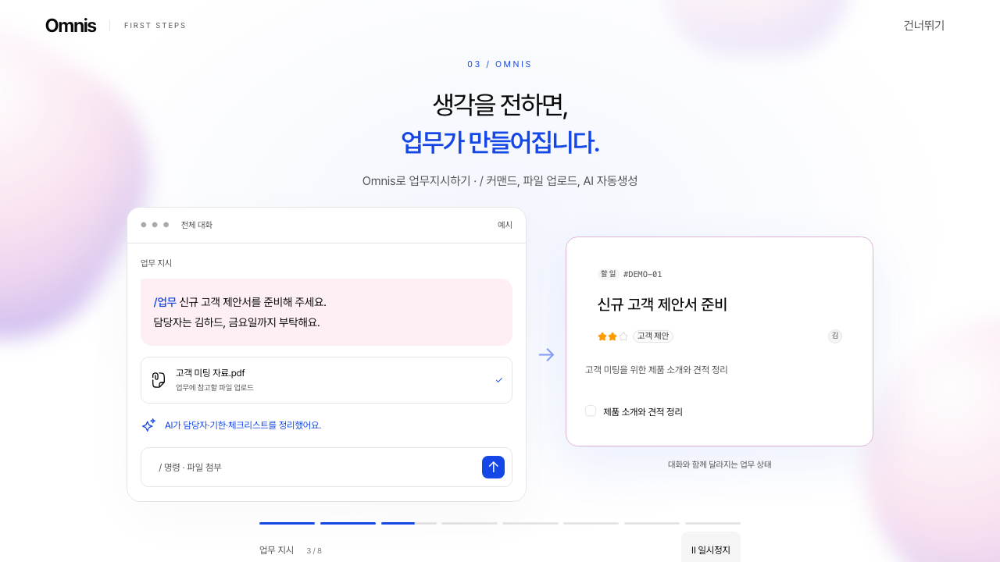
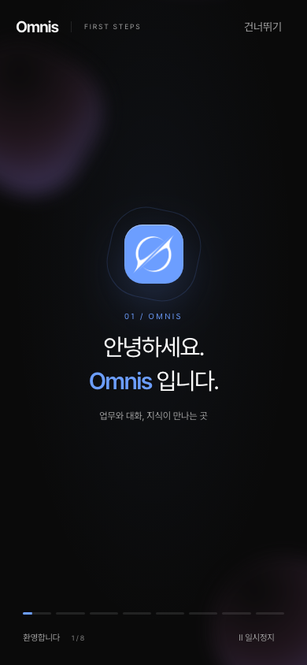

# Omnis 온보딩 구현·검증

사용자 승인 뒤 `feat/omnis-onboarding`에서 구현했다. 사용자 화면 검토 대기이며 main 머지·push·운영 DB 적용·배포는 수행하지 않았다.

## 구현 결과

- Hub의 중앙 타이포그래피·블러 전환·부유 도형을 Omnis 로고·색상·라이트/다크 토큰으로 옮겼다. 스크린샷을 재생하는 방식이 아닌 React/CSS 애니메이션이다.
- 사용자 추가 요청에 따라 실제 `TaskCard`의 읽기 전용 렌더링을 추가하고 기존 Badge·Checkbox·Avatar·Textarea와 Magic UI ShineBorder를 재사용했다. 예시 카드에는 링크나 업무 쓰기가 없다.
- 8장면이 자동 전환된다. `/업무` 입력, 파일 첨부, AI 정리, 카드 생성, 완료 보고와 담당자 확인, 추가 지시 후 진행 중 상태를 표현한다. 최종 「업무 시작하기」에서 자동 종료를 멈추고 사용자를 기다린다.
- 버튼 뒤 실제 화면을 8단계로 안내한다: 업무 → 대화 버튼 → 대화 영역 → Omnis AI → 회사 도구 → 프로필 → MCP → 다시 보기. 기본 자동 진행에 일시정지·건너뛰기를 제공한다.
- 화면 확대 비율과 모바일을 반영해 DOM 좌표를 측정한다. 모바일 메뉴는 안내 중 비모달로 열어 튜토리얼이 키보드 포커스를 맡는다. 안내 후 메뉴·패널의 원래 열림 상태를 복원한다.
- 이미 열려 있는 대화/AI 탭을 전환하지 않는다. 작성 중인 내용을 보존하며, AI 탭이 열려 있으면 전체 대화로 전환하는 방법을 설명한다. 원래 URL을 바꾸지 않는다.
- 일시정지·비활성 탭에서는 재생 시간을 소비하지 않는다. 모션 감소에서는 블러·부유 효과를 제거하고 자동 전환의 읽기 시간은 유지한다. Escape와 키보드 포커스 순환을 제공한다.
- 프로필의 「온보딩 튜토리얼」에서 재생 가능하다. 「Omnis MCP 등록」은 주소 복사와 기존 OAuth 연결 안내창을 연다. 외부 AI 앱 등록을 완료했다고 표시하지 않는다.
- Magic UI 공식 registry의 ShineBorder와 MIT 라이선스를 포함했다. 출처: https://magicui.design/docs/components/shine-border, https://magicui.design/r/shine-border.json.

## 계정 상태·마이그레이션

`User.onboardingVideoSeenAt`과 `User.onboardingCompletedAt`을 nullable timestamp로 추가했다. 기존 계정도 다음 첫 접속에 안내를 받는다. 영상만 마치면 다음 접속은 스포트라이트부터 시작한다. 건너뛰기도 해당 안내를 본 것으로 저장한다. 다시 보기는 기존 완료 이력을 지우지 않는다.

`/api/onboarding`은 활성 로그인 계정만 읽고 쓸 수 있다. POST 본문은 Zod strict schema의 video/complete만 허용한다. 사용자 ID·완료 시각 직접 지정과 다른 origin을 거부한다. 완료 쓰기는 NULL인 필드만 갱신하여 반복·순서가 바뀐 요청에도 완료 이력이 되돌아가지 않는다. 저장 실패 시 서비스는 계속 사용할 수 있고 토스트에서 다시 저장할 수 있다.

대상 확인: `localhost:5433/omnis`. 로컬 DB에 다른 작업의 마이그레이션 2개가 추가되어 있음을 확인했다. reset이나 기존 이력 수정 없이 `migrate deploy`로 이번 pending migration만 적용했다.

```text
$ npx prisma migrate deploy
Datasource "db": PostgreSQL database "omnis", schema "public" at "localhost:5433"
Applying migration `20260914000000_onboarding`
All migrations have been successfully applied.

$ npx tsx scripts/backfill-onboarding.ts
대상: localhost:5433/omnis
온보딩 백필: 기존 계정 NULL 유지, 기존 완료 기록 보존. 잘못된 상태 0건.
```

백필 스크립트는 기존 사용자가 보았다고 꾸미거나 완료 기록을 초기화하지 않는다. 운영 반영 시 앱 코드보다 먼저 이 마이그레이션을 적용해야 한다.

## 검증 실측

```text
$ npm run verify
> npm run typecheck && npm run lint
> tsc --noEmit
> eslint
✖ 41 problems (0 errors, 41 warnings)
exit 0
```

41개는 기존 파일의 unused-vars·React Hooks·img 관련 경고다. 이번 온보딩 파일에는 오류·경고가 없다.

```text
$ npm run build
> prisma generate && next build --webpack
✓ Compiled successfully in 7.8s
  Running TypeScript ...
✓ Generating static pages using 11 workers (46/46) in 96.9ms
exit 0
```

```text
$ npx playwright test tests/feature/onboarding.spec.ts --project=feature --retries=0
✓ 8장면 자동 재생·일시정지·최종 CTA·스포트라이트
✓ 계정 저장·새 브라우저·다른 계정·재생·MCP 주소 복사
✓ 잘못된 요청·타 계정 쓰기·비활성 계정 거부, 반복 완료 멱등성
✓ 영상만 마치면 스포트라이트부터 재개, 실패해도 서비스 이용 가능
✓ 비활성 탭에서 재생 정지, 키보드 종료, 작성 중인 AI 질문 보존
✓ 모바일·다크·모션 감소에서 메뉴 안내와 종료 버튼 도달
6 passed (47.3s)
```

테스트마다 격리된 임시 계정을 만들고 정리한다. 로컬 DB 외에는 실행하지 않는다. 검증 뒤 `onboarding-` 접두사 임시 계정 잔여는 0건이다. 실시간 DB·HTTP·브라우저를 사용하며, 애니메이션의 시간만 Playwright clock으로 전진시켰다. 실제 캡처에서는 CSS 전환이 끝난 화면을 확인했다.

발견해 수정한 문제:

- React functional updater가 실행되기 전에 기준 시간이 바뀌어 일부 tick이 누락됨 → delta를 먼저 계산하여 고정.
- 모바일 아래쪽 안내창에 기본 top과 bottom이 함께 적용되어 높이가 늘어남 → 아래쪽 배치에서는 top을 auto로 해제. 모바일 안내창 높이 검사 추가.
- Playwright Chromium 다운로드 후 Node 압축 해제가 멈춤 → 다운로드된 동일 압축 파일을 시스템 unzip으로 해제하여 실행.

```text
$ npm start -- --port 3001
$ curl -s -o /dev/null -w 'production /login HTTP %{http_code}\n' http://localhost:3001/login
production /login HTTP 200
$ curl -s -o /dev/null -w 'production /api/onboarding (unauthenticated) HTTP %{http_code}\n' http://localhost:3001/api/onboarding
production /api/onboarding (unauthenticated) HTTP 401
```

로컬 프로덕션 빌드에 대한 HTTP 요청이며 외부 배포본 검증은 아니다.

## 전체 E2E 제한

기존 전체 feature suite의 로그인 전제인 팀장·부팀장·사원1·사원2·사원3 계정이 로컬 DB에 하나도 없다(읽기 조회: `0 / 5`). 따라서 전체 E2E 게이트는 통과하지 못했다. 기존 DB를 demo seed로 덮어쓰지 않았다.

초기 `npm run test:e2e -- --max-failures=3 --retries=0` 실행은 로그인 3건 실패, 2건 통과, 35건 미실행이었다. 동시에 실행한 전용 테스트와 기본 결과 디렉터리가 겹쳐 trace ENOENT도 발생했다. 원인을 구분하기 위해 아래 재실행은 별도 결과 디렉터리를 사용했다.

```text
$ npm run test:e2e -- --max-failures=1 --retries=0 --output=/tmp/omnis-existing-suite-results
✓ 로그인 페이지가 시연용 데모 안내를 표시한다
✓ 잘못된 비밀번호는 에러 메시지를 보여준다
✘ 관리자 계정 팀장 로그인 → 대시보드 진입
TimeoutError: page.waitForURL: Timeout 15000ms exceeded.
Testing stopped early after 1 maximum allowed failures.
1 failed
37 did not run
2 passed (1.3m)
```

별도 디렉터리 재실행에서는 trace ENOENT가 없었으며, 동일한 데모 계정 로그인 실패가 재현되었다. 전체 suite 통과로 보고하지 않는다.

## UX 규칙 11~30 점검

- 11~12: native alert/confirm/prompt·빈 핸들러 없음. 데모 카드는 readOnly, 체크박스·우선순위는 disabled이며 이미지 설명 영역 안에 있다.
- 13, 23: 상태 변경 입력은 Zod strict schema, Prisma 변경과 migration·백필 정책/스크립트 포함.
- 14~15: 온보딩·MCP popup은 `--z-dialog`; 기존 DialogHeader/Footer 구조 유지.
- 16~17, 20~22, 24~25, 27~28: 기존 detail/grid/탭 구조 변경 없음. 데모는 전용 읽기 화면이며 상태 배지 표시. MCP 조회는 loading/error/retry 제공.
- 18~19: 예시 대화는 읽기 전용 설명 영역과 Textarea를 함께 표시. 실제 TaskCard의 readOnly 렌더링 재사용.
- 26: 텍스트 버튼·포커스 표시·포커스 순환·Escape·모션 감소 제공. 본문은 Omnis foreground/muted-foreground 토큰 사용.
- 29: 저장·복사 실패는 토스트, MCP 주소 조회 실패는 인라인 오류와 재시도.
- 30: 390×844 모바일 가로 넘침 없음, 버튼 44px 이상, 모바일 사이드바와 안내창 위치 확인. 낮은 화면에서는 소개 화면을 세로 스크롤할 수 있다.

## 화면




